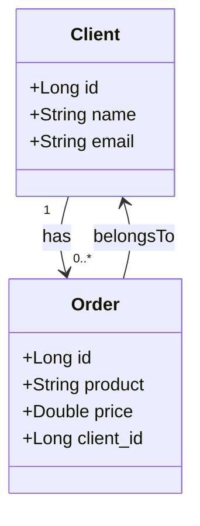

# client-api 🚀

## 🌟 Descrição

Bem-vindo ao **client-api**! 😎  
Este é um projeto em Java para a criação de uma API RESTful, desenvolvido como parte de um desafio de **LAB da DIO** (Digital Innovation One). Ele utiliza **Spring Boot**, **JPA**, **Hibernate** e **MySQL** para a persistência de dados, e **Railway** para o deployment. 

A API permite o **cadastro de clientes** com as operações CRUD (Criar, Ler, Atualizar, Excluir). Simples, eficiente e escalável! 🔥

## 🛠️ Tecnologias Usadas

- **Spring Boot**: O framework que acelera o desenvolvimento da sua API REST.
- **JPA (Hibernate)**: Mapeamento objeto-relacional, para que você se concentre no código e não nos detalhes do banco de dados.
- **MySQL**: Banco de dados relacional para armazenar todas as informações de clientes.
- **Railway**: Deployment fácil e sem complicação na nuvem.
- **Maven/Gradle**: Ferramentas para gerenciamento de dependências e builds (escolha a que preferir!).

## 🔥 Funcionalidades

O **client-api** te oferece um CRUD completo para **Clientes**:
- **Criar** novos clientes.
- **Listar** todos os clientes.
- **Visualizar** detalhes de um cliente específico.
- **Excluir** um cliente.

Agora você pode gerenciar clientes com facilidade e sem complicação! 😄

### 📥 Pré-requisitos

Antes de começar, verifique se você tem o seguinte instalado:
- **JDK 11 ou superior** ☕
- **MySQL** (ou qualquer outro banco relacional configurado no `application.yml`) 🗄️
- **Maven ou Gradle** para rodar o projeto 🚧

📝 Uso
Exemplos de Requisições API
1. Criar um cliente ✨
Método: POST
Endpoint: /clients
Body:

```json
{
  "name": "John Doe",
  "email": "john.doe@example.com"
}
```



