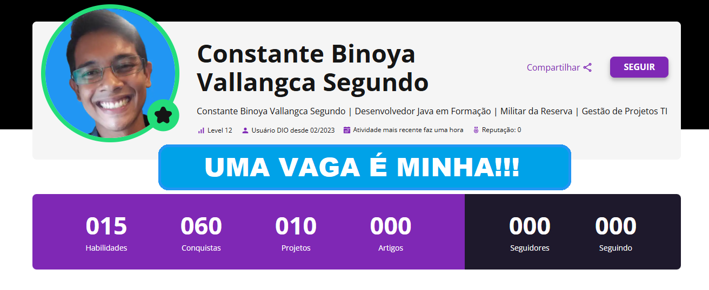
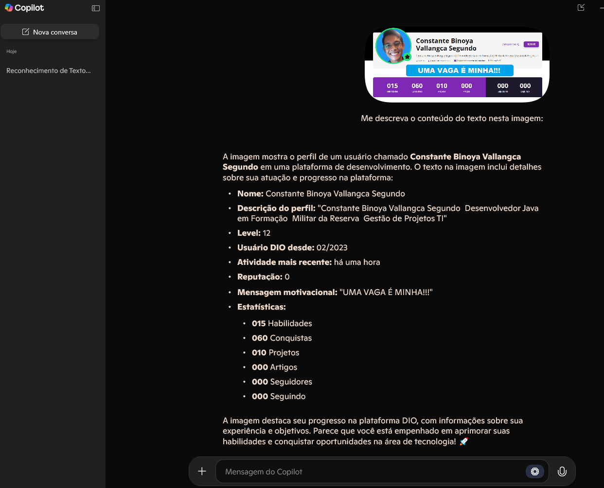

# 🚀 Projeto de **Reconhecimento de Texto em Imagens** 📸

Bem-vindo ao meu repositório! Este projeto tem como objetivo demonstrar o uso de técnicas avançadas de **Reconhecimento Óptico de Caracteres (OCR)** em imagens. Ao longo desta jornada, explorei o poder de bibliotecas como o **Tesseract OCR** para extrair texto de imagens e transformá-lo em informações utilizáveis.

## 🔍 Objetivo do Projeto

O projeto visa não apenas a extração de texto de imagens, mas também o aprimoramento da precisão e da qualidade dos resultados obtidos. Acompanhe os detalhes deste trabalho e descubra como um simples processo pode ser otimizado para obter resultados surpreendentes!

## 🛠️ Ferramentas Utilizadas

- **Copilot IA**: Utilizado para realizar o reconhecimento de texto nas imagens, transformando dados visuais em informações processáveis com alta precisão.
- **Paint**: Utilizado para editar e aprimorar imagens antes de serem processadas, ajustando brilho, contraste e outras características visuais para melhorar a legibilidade.
- **Snipping Tool**: Ferramenta de captura de tela do Windows, usada para selecionar e capturar áreas específicas da tela, útil para obter imagens de documentos ou partes da tela que precisam ser analisadas ou processadas.

## 🔑 Como Funciona

1. **Imagens de Entrada**: As imagens estão localizadas na pasta `inputs`, prontas para serem processadas.
2. **Processamento e Reconhecimento**: Utilizando o Copilot IA, o texto presente nas imagens é extraído automaticamente.
3. **Resultado**: O texto extraído é salvo na pasta `output`, organizado e pronto para uso.

## 📊 Resultados Alcançados

O sistema foi capaz de:
- **Extrair texto** com alta precisão de diversas imagens.
- **Identificar padrões** de texto em imagens com diferentes níveis de qualidade.

### 🧐 O Que Você Vai Encontrar Aqui?

- **Imagens de Teste**: Exemplos de entradas que passaram pelo processo de OCR.
- **Resultados de Reconhecimento**: Textos extraídos das imagens, armazenados para análise.
- **Insights e Aprendizados**: Dicas sobre como melhorar a precisão do OCR e os desafios encontrados ao longo do processo.

## 🧠 Insights e Lições Aprendidas

- **Qualidade da Imagem é Crucial**: A clareza das imagens tem impacto direto no desempenho do OCR. Descobri técnicas de pré-processamento que melhoram a precisão dos resultados.
- **Textos Complexos Demandam Tratamento Especial**: Imagens com textos distorcidos ou fontes pouco legíveis podem precisar de ajustes, como aumento de contraste ou remoção de ruído, antes de passar pelo OCR.

## 📅 O Que Vem a Seguir?

Embora o reconhecimento de texto tenha sido realizado com sucesso, sempre há espaço para melhorias:
- **Melhorias no Pré-processamento**: Como ajustar dinamicamente as imagens para otimizar o OCR.
- **Suporte Multilíngue**: Adicionar suporte a diferentes idiomas para reconhecimento de texto em imagens globais.
- **Aprimoramento com Deep Learning**: Explorar o uso de redes neurais para aumentar a precisão do reconhecimento.

## 📸 Exemplos de Imagens

Aqui estão alguns exemplos das imagens utilizadas neste projeto:

*Imagem antes do processamento*

*Texto extraído após o processamento*

## 🔗 Acesse o Repositório

Clique no link abaixo para conferir o código, as imagens e os resultados completos do projeto. 👇

[Visite o Repositório no GitHub](https://github.com/ConstanteBinoya)

---

### 🔔 **Por que este projeto é importante?**

Este projeto não só é uma demonstração técnica, mas uma prova de que o uso eficiente de ferramentas como o Copilot IA - OCR pode transformar dados não estruturados em informações valiosas. Ele pode ser aplicado em diversas áreas, como automação, análise de documentos e até mesmo digitalização de textos históricos!

## 💡 **Fique à vontade para contribuir!**

Se você tem sugestões, ideias ou melhorias para o projeto, ficarei feliz em ouvir! Contribuições são sempre bem-vindas.

