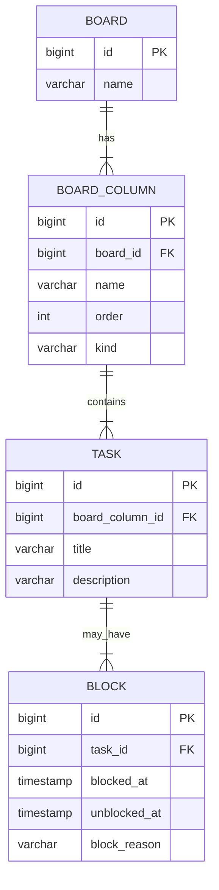

# 📝 TaskFlow - Gerenciador Inteligente de Tarefas

## 🚀 Sobre o Projeto
Este projeto faz parte do conjunto de entregas do bootcamp Decola Tech 2025, oferecido pela DIO (Digital Innovation One) em parceria com a Avanade.

O TaskFlow foi desenvolvido como um desafio prático para consolidar conhecimentos em Java, Banco de Dados, ORM e Arquitetura de Software. O objetivo é criar um sistema de gerenciamento de tarefas baseado em quadros e colunas, permitindo que usuários organizem suas atividades de forma eficiente. ✅📊

Ao longo deste projeto, foram aplicadas as melhores práticas de desenvolvimento, incluindo:  
🔹 Modelagem de Banco de Dados com MySQL + Liquibase  
🔹 Desenvolvimento em Java seguindo o padrão MVC  
🔹 Gerenciamento de dependências com Gradle  
🔹 Diagramação de Classes com Mermaid

Este repositório contém todo o código-fonte, documentação e instruções necessárias para executar o TaskFlow. 🚀🔥

---

### 📌 Visão Geral
O TaskFlow é um sistema intuitivo de gerenciamento de tarefas baseado em quadros e colunas, ideal para acompanhar o fluxo de trabalho de projetos. 🔄📊

Seja para organizar atividades pessoais, planejar sprints ágeis ou gerenciar equipes, o TaskFlow fornece uma solução dinâmica e eficiente! ✅🔥

---

### 💡 Principais Recursos
✨ Criação de Quadros Personalizados – Organize suas tarefas em quadros, adaptando-os conforme suas necessidades.  
📌 Movimentação de Tarefas – Arraste suas tarefas entre colunas para acompanhar o progresso.  
🚧 Bloqueio e Desbloqueio de Tarefas – Marque tarefas como bloqueadas quando houver impedimentos e libere quando estiverem prontas.  
🗑️ Cancelamento de Tarefas – Remova tarefas desnecessárias ou obsoletas.  
🗄️ Histórico de Alterações – Acompanhe mudanças e status das tarefas ao longo do tempo.  
🛢️ Banco de Dados Integrado – Usa MySQL + Liquibase para versionamento e persistência de dados.  
⚡ Interface Simples e Funcional – Navegação via linha de comando (CLI) de forma intuitiva.

---

### 🛠️ Tecnologias Utilizadas
🚀 Java 17 – Linguagem principal do projeto.  
🛢️ MySQL – Banco de dados relacional para armazenar os quadros e tarefas.  
📜 Liquibase – Gerenciamento de migrações do banco de dados.  
🔄 Gradle – Ferramenta de build e gerenciamento de dependências.  
🎯 Lombok – Simplificação do código eliminando a necessidade de métodos boilerplate.

---

### 📂 Estrutura do Projeto
A estrutura do TaskFlow segue o padrão MVC (Model-View-Controller), garantindo organização e modularidade.

```bash
📦 taskflow  
 ┣ 📂 src/main/java/br/com/binoya/taskflow  
 ┃ ┣ 📂 dto                 # Objetos de Transferência de Dados (DTOs)  
 ┃ ┣ 📂 exception           # Tratamento de erros e exceções personalizadas  
 ┃ ┣ 📂 persistence         # Camada de persistência (DAO, Config, Entidades)  
 ┃ ┣ 📂 service            # Lógica de negócios (gerenciamento de quadros e tarefas)  
 ┃ ┣ 📂 ui                 # Interface do usuário (menus interativos)  
 ┃ ┗ 📜 Main.java           # Ponto de entrada da aplicação  
 ┣ 📂 resources  
 ┃ ┗ 📂 db/changelog       # Scripts de migração do banco via Liquibase  
 ┣ 📜 build.gradle.kts     # Configuração do Gradle  
 ┣ 📜 settings.gradle.kts  # Configuração do nome do projeto  
 ┣ 📜 README.md            # Documentação do projeto  
```

---

### 📌 ORM das Entidades (Diagrama ER)
Aqui está o diagrama de entidades do TaskFlow, pronto para ser inserido no formato Mermaid no seu README.md:

🎨 Modelo ER (Entidade-Relacionamento)



### 🔹 Explicação das Entidades
📌 BOARD – Representa um quadro onde as tarefas são organizadas.  
📌 BOARD_COLUMN – São as colunas dentro de um quadro (To-Do, Em Progresso, Finalizado, etc.).  
📌 TASK – Representa uma tarefa dentro de uma coluna.  
📌 BLOCK – Registra bloqueios e motivos associados a uma tarefa.

---

### 🎯 Próximos Passos e Melhorias
🚀 Integração com Interface Gráfica – Planejamos uma versão Web com Spring Boot e React.js.   
📱 Versão Mobile – Um aplicativo Android/iOS para gerenciamento de tarefas em qualquer lugar.   
🔗 API RESTful – Possibilidade de integração com outras ferramentas de produtividade.

---

### 👥 Contribuindo
Gostou do TaskFlow? Quer contribuir? 💡

Crie um Fork do repositório.
Desenvolva sua feature em uma branch separada.
Faça um Pull Request com as melhorias.
Toda ajuda é bem-vinda! 🚀🔥

---

### 📬 Contato
Se tiver alguma dúvida, sugestão ou feedback, fique à vontade para entrar em contato! Vamos conversar! 😃

Email: constantebinoyaz1@gmail.com   
GitHub: https://github.com/ConstanteBinoya
